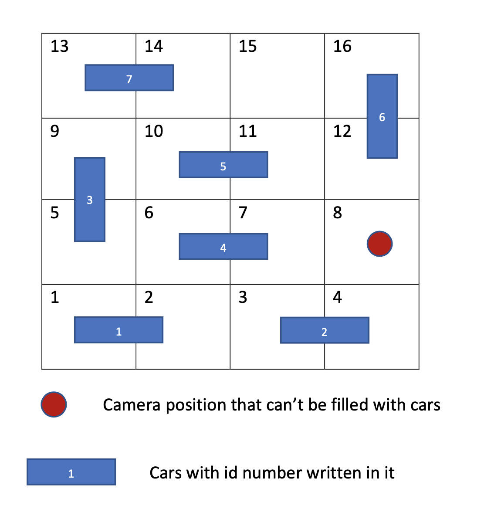
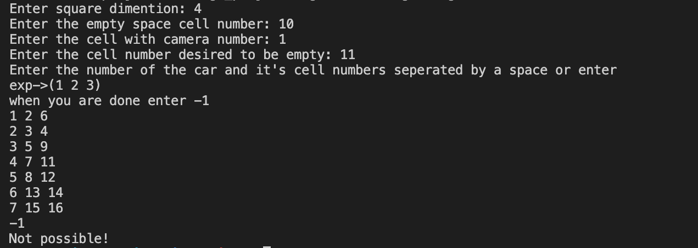
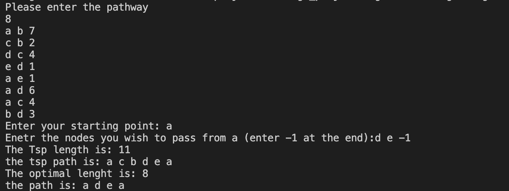

# Algorithm-design
Algorithm design's Project

Written by Mitra Omrani

This project contains 3 tasks, each is discussed individually :

# Task 1 

## Question :
Given Car's possition, claim if it's possible to move cars in their directions such way that the desired possition is empty.
If it's possible print number of movements required and car's id number in order of moving.
If it's not possible  print "impossible".

## Query :
1. Squer dimension 
2. Empty cell's position
3. Cell's possition with Camera in it
4. Cell's id number, desired to make empty 
5. Number of cars
6. Each car's id number and spaces it takes
7. when done enter `-1`.

Example :

    4
    15
    8
    7
    1 1 2
    2 3 4
    3 5 9
    4 6 7
    5 10 11
    6 12 16
    7 13 14
    -1
 
As you may see in the diagram :

The resault would be : 

One example for `not possible!` :

## Algorithm's used in task1: Backtracking 
* Strating from the empty possition we check all four neighbors and calculate each cars' move in those position.
* We use Depth first search for finding the answer.
* The answer  is retured when we empty the desired space.

# Task2-A

## Question :
* Given the relation between each two city, calculate shortest path from a given starting point to a given ending point.
* Print the path alongside with path's length. 
* Cities' path is two sided, meaning if the path's length from `a` to `b` is `18`, path's length is the same from `b` to `a`.

## Query :
1. Number of the relations between each two cities.
2. Separate cities' name by a space and then enter the length between these two.

Example:

    8
    a b 7
    c b 2
    d c 4
    e d 1
    a e 1
    a d 6
    a c 4
    b d 3
    c
    e

* Given the starting and ending points it is abled to print all possible paths alongside the path's length.

## Algorithm's used in task2-A: Dijkstra
* Our starting point in dijkstra is the starting point and we find all shortest path from the starting point to all other points.
* We save the length in an array including shortest path from starting point to all others and print our desired one at last.
* We save the path in a array with vector type and recursively print the path from end to start.

# Task2-B

## Question :
* Given the realtion between cities and starting , print the shortest path that we must pass by given certain cities.
* In the end we must come back to our starting point, in other words print the cycle.

## Query:
1. Number of the relations between each two cities.
2. Separate cities' name by a space and then enter the length between these two.
3. Staring point 
4. Must pass cities' name separated by space.
5. when done enter `-1`

Example:

    8
    a b 7
    c b 2
    d c 4
    e d 1
    a e 1
    a d 6
    a c 4
    b d 3
    a
  

## Algorithm's used in task2-B: Floyed and Tsp
* Tsp will give us the shortest cycle from a starting point.
* Floyd will give us shortest path between each two city.
* While applying the floyd algorithm we save the cities between each two cities  that make tha path shorter between that two.
* We know that it is not necessary in this question that we pass all cities, so we check if we delete a city that is not in must-pass cities, would it make a shorter path or not. If so we decrease the lenght that adding that city in between would creat and we print the new path alongside the lenght of it.
* So we use tsp, and check if can make a shorter path by deleting not must-pass cities.
8 In the fromer example shown in the picture, we could see that if we don't pass `b` and `c` we could have a shorter path.

# Task 3

## Question :
* Given the relation between each two cities, print relations that include all citiies, and from each can reach to another.
* You should be able to go from any chosen cities to another one, meaning all cities must can be reached from one another.

## Query :
1. Number of the relations between each two cities.
2. Separate cities' name by a space and then enter the length between these two.

Example :

    8
    a b 7
    c b 2
    d c 4
    e d 1
    a e 1
    a d 6
    a c 4
    b d 3
    
    

## Algorithm's used in task3: MST
* Both kroskal and MST could be used for this question, but considering the query and it's size, MST might be a better approach.
